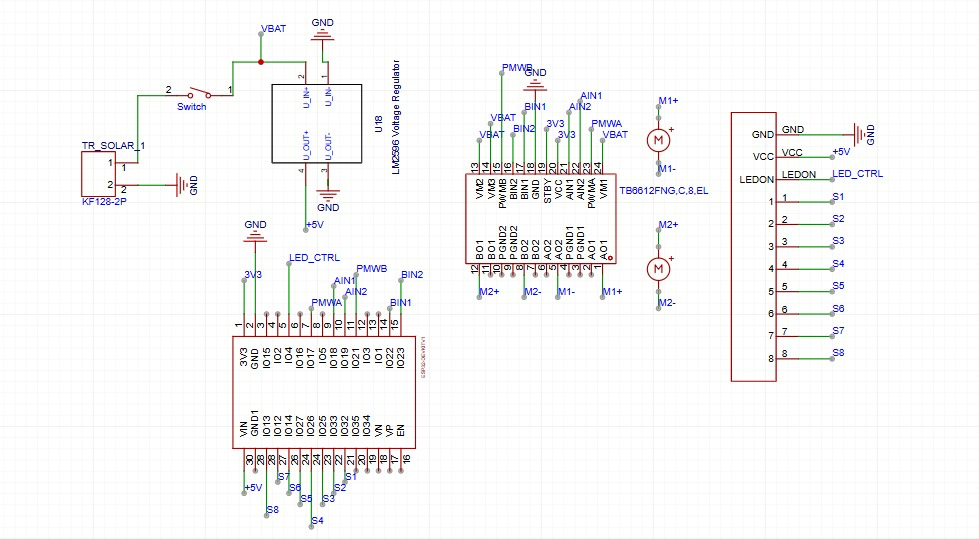

# Breadcrumb - ESP32 Line Follower

A high-performance, modular C++ firmware for an ESP32-based line-following robot. This codebase is designed for competitive racing, utilizing sub-millimeter analog sensor math, deterministic 100Hz PID control loops, and live Bluetooth tuning.

## Features
- 🏎️ **Fast & Smooth:** Uses an incredibly precise "barycentric" (center of mass) algorithm to calculate the exact position of the line beneath the robot, rather than relying on on/off digital thresholds.
- ⏱️ **Deterministic Control:** The main loop executes at exactly 100Hz guaranteeing that the derivative (shock-absorbing) math behaves consistently across battery levels.
- 📱 **Live Wireless Tuning:** Features a non-blocking asynchronous Bluetooth listener. You can tune PID and Speed values on-the-fly from a smartphone without ever unplugging the robot or resetting the board.
- 🧩 **Modular Architecture:** The codebase is split logically (Sensors, Motors, PID, Bluetooth). Replacing hardware only requires changing a single file instead of rewriting an entire massive script.

---

## Hardware 
* **Microcontroller:** ESP32 (Dev Module)
* **Motor Driver:** TB6612FNG Dual Motor Driver
* **Sensors:** Pololu QTR-8A (Analog) Reflectance Sensor Array

### Wiring / Pinout (`Config.h`)
The complete pin map can be updated in `Config.h`. By default, it expects:

**QTR-8A Sensor Array:**
* `Sensor 1 (Left)` -> Pin 32
* `Sensor 2` -> Pin 33
* `Sensor 3` -> Pin 25
* `Sensor 4` -> Pin 26
* `Sensor 5` -> Pin 27
* `Sensor 6` -> Pin 14
* `Sensor 7` -> Pin 12
* `Sensor 8 (Right)` -> Pin 13

**TB6612FNG Motor Driver:**
* `PWMA (Left Spd)` -> Pin 5
* `AIN1` -> Pin 18
* `AIN2` -> Pin 19
* `PWMB (Right Spd)` -> Pin 21
* `BIN1` -> Pin 22
* `BIN2` -> Pin 23
* `STBY` -> Hardwire to 3.3V

*(Note: If a motor spins backwards when driving straight, simply swap the motor's two physical wires or swap its `IN1`/`IN2` states in `Motors.cpp`).*

---

## Live Bluetooth Tuning
Instead of hardcoding new values every time the robot crashes, pair your phone to the robot using a generic Bluetooth Serial Terminal App. 
* **Device Name:** `Breadcrumb_BT`

Send the following text commands to instantly update its memory:
* `P<value>` : Update Proportional (e.g. `P12.5`)
* `D<value>` : Update Derivative (e.g. `D3.0`)
* `I<value>` : Update Integral (e.g. `I0` - usually keep this 0)
* `S<value>` : Update Base Speed (e.g. `S150`)

### Tuning Strategy
1. Send `P0`, `I0`, `D0` to stop the motors/steering.
2. Send `S100` (or whatever base speed you desire).
3. Gradually increase **Kp** (`P1`, `P3`, `P8`) until the robot can follow the track, but is wobbling aggressively left and right like it drank too much coffee.
4. Once it is successfully following the line (but wobbling), start gradually increasing **Kd** (`D1`, `D2`, `D5`). This acts as the shock absorber. Keep increasing it just until the wobble totally disappears and the robot glides magically smooth on the straights. 
5. Repeat for faster speeds!

## First Run & Calibration
1. app d arduino **file > open > hadfolder > suiveur.ino** (ghayt7lo ga3 les fichier cpp o h)
2. Open the **Arduino Serial Monitor** and set it to **115200 baud**.
3. Upon booting, you have a 2-second grace period to place the robot over the line.
4. **Calibration (5 seconds):** You will be prompted to calibrate. During this phase, manually slide the front of the robot back and forth perfectly horizontally across the black line and white background. This allows the sensors to learn the absolute brightest and darkest reflective values of your specific track floor.
5. After calibration finishes, the robot will pause for 1 second and then speed away.

mhm app fi tawer conception . melli i salli montage n9ado hadchi# Fil-Dariane-esp32
# Fil-Dariane-esp32
